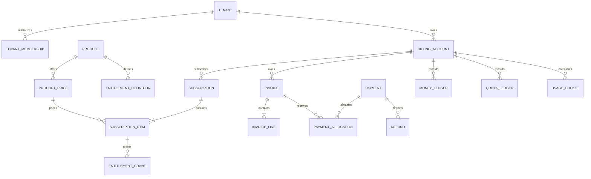
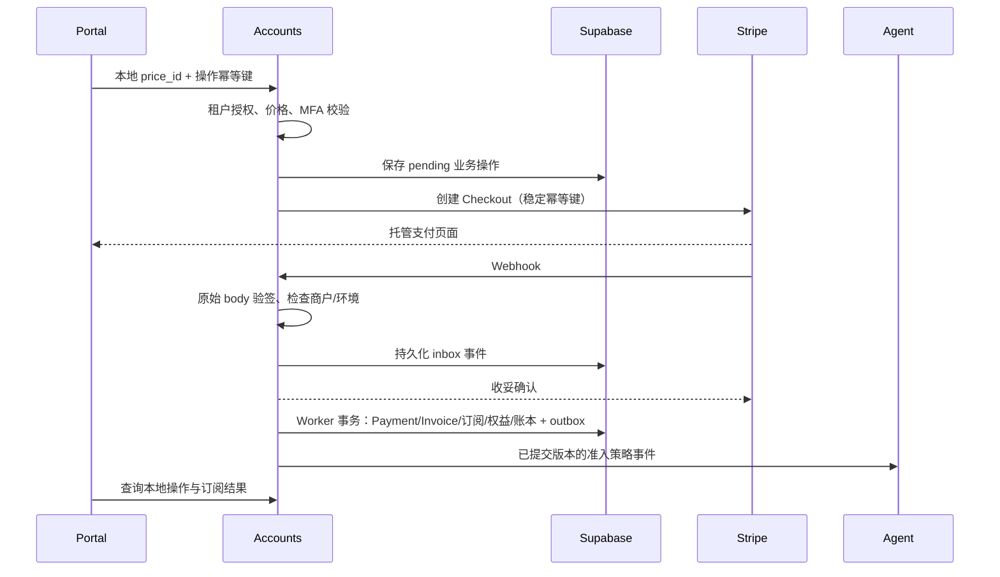

# 租户、订阅与本地财务架构

日期：2026-10-04。状态：目标架构与增量实施设计；本文不表示模型已经上线。

## 1. 目标与约束

以 Supabase/PostgreSQL 作为租户、套餐、订阅、权益、账单和用量的持久化事实源。Stripe 是当前支付适配器，负责收款、续费和退款的外部执行及事件通知；外部执行结果在本地留存并对账。更换支付 Provider 不改变 Portal 产品结构、用户分组和代理策略。

- 保留现有 Portal 布局，逐步补齐接口背后的业务模型。
- 永远不硬删除用户、订阅、付款、退款和用量账本；调整通过状态变更和追加分录完成。
- 核心配额分组为 `free / plus / payasgo / custom（定制）`：Free 5GB、Plus 20GB；payasgo 按量结算，custom 按合同或管理员明确指派的权益。充值、月付、年付属于价格/收款方式，不应和配额组混为一谈。无限制内测作为定制权益策略保留，不再作为第五个核心分组。
- 新用户默认 Free 5GB；既有注册用户属性不批量覆盖，管理员分配须可预览、审计和追踪。
- 额度耗尽暂停代理、停止同步用户配置，立即终止入口连接；保留用户与连接凭据。
- UAT 先验收；数据库只做原地增量升级，不重复从 PROD 同步，不重建旧表。

## 2. 已检查的实现与差距

以下结论以 Accounts `main` 提交 `967e0c6463c18d21afe01d612eff561eec46570b` 的实现为基线，不构成已部署数据库的实测结果。原 Accounts 工作区有既有未提交改动，本次文档在独立工作区提交，没有修改它们。

| 领域 | 已有实现 | 目标缺口 |
| --- | --- | --- |
| 租户 | `Tenant`、域名、成员关系、XWorkmate Profile | 没有独立 BillingAccount 及明确的计费成员授权 |
| 目录 | `billing_plans`，本地 `plan_id`，价格/配额/features，`stripe_price_id` | Product、可版本化 ProductPrice、Provider 映射仍耦合在套餐表 |
| 订阅 | `subscriptions.uuid`，`user_uuid`、provider、external_id、plan_id、status、meta | 缺少显式租户计费归属、SubscriptionItem、完整本地周期和状态字段 |
| 财务 | `billing_ledger`、余额/欠费状态、价格规则版本；`finance_invoices/payments/refunds`、整数金额、不可变事实、操作记录及事件 | 租户 BillingAccount 归属、InvoiceLine、付款分配、Provider 商户/环境隔离及支付业务完整接入待补 |
| 计量 | 节点累计检查点、分钟桶、账户计费 Profile、QuotaState | 用户维度需平滑映射至 BillingAccount，配额账本需与金额账本分离 |
| Stripe | Checkout、订阅查询/取消、退款、Webhook 验签及事件记录；已有通用财务操作持久化模型 | 需要统一 Provider 接口，将支付/退款路径接入财务操作重试与对账闭环 |
| 退款 | 首次 Stripe 订阅、7 天窗口、用量低于套餐额度 5%，远端退款后取消并降级 | 退款业务状态与补偿工作流尚需独立建模 |

`subscriptions` 当前唯一约束是 `(user_uuid, external_id)`；多 Provider、多商户、多环境后不能仅凭 external_id 定位对象。财务相关旧外键包含 `ON DELETE CASCADE`，与历史保护目标冲突；必须在正式迁移中审计并替换，不能假定应用不调用删除就足够。

旧套餐目录文档提出 Free 时间窗口、窗口耗尽降级而不断线，以及 Pro 超额自动计费。这些是参考方案，**不覆盖本项目的 Free 5GB / Plus 20GB 超额立即断流要求**。按量超额计费仅允许用于明确配置并展示的 PAYG 产品；不能静默开启。

## 3. 领域关系

### 核心特性范围

交付主线是 **Stripe 订阅支付**，由以下四个 P0 模块构成完整闭环。以下均为目标要求，不能以页面可见或接口存在代替 UAT 验收。

| 模块 | 必须完成 | 完成标准 |
| --- | --- | --- |
| P0-A Agent 断流 | 消费账户准入策略；拒绝新连接并终止已建立连接；暂停用户配置同步；保留凭据；恢复按完整策略判定 | 超额/欠费/管理员暂停事件到实际入口断开的延迟可测；重复、乱序事件及漏事件恢复通过；用户与历史不删除 |
| P0-Q 配额分组管理 | free/plus/payasgo/custom；单选和批量分组、有效期、预览和审计；新用户 Free 5GB；旧用户管理员分配 | 四组实际行为、批量部分失败、有效期结束与周期重置一致；余额/历史不清空；定制策略明确 |
| P0-S 订阅状态机 | 下单、待支付、有效、续费、支付失败、期末取消、到期降级、退款后权益处理 | Stripe 支付事实只触发一次状态变更；支付成功激活，取消保留至期末；没有其他有效付费权益才降为 Free |
| P0-F 本地财务模型 | BillingAccount、价格版本、Invoice/Payment/Refund、金额与配额账本、Provider 映射及事件对账 | 并发/重放不重复入账；部分退款和超退控制；外部成功本地失败可恢复；金额和历史可审计 |

Stripe 对接是四个模块的集成主线，既有 Checkout/退款代码作为迁移基础；只有 Test mode 的下单 → 付款确认 → 本地账单 → 权益生效 → 用量结算 → 断流/恢复 → 取消或退款闭环通过，才完成订阅支付 P0。

### 四类配额分组

| 分组 | 权益与付款 | 停止代理条件 | 恢复条件 |
| --- | --- | --- | --- |
| free | 每月 5GB；无需 Stripe 付款 | 生效额度耗尽，或归档/管理员暂停 | 新配额周期或审核后的额度调整，且无其他暂停原因 |
| plus | 每月 20GB；支持 Stripe 月付/年付 | 生效额度耗尽；付费失效按状态机降级；欠费按明确政策处理 | 配额恢复或重新获得有效权益；付款不能无条件清除所有暂停原因 |
| payasgo | 按版本化费率消耗本地预付余额；Stripe 收取充值款；无自动固定月度赠额 | 可用余额不足以支付下一结算单位；P0 默认不允许透支 | 付款确认入账或审核后的余额调整，且完整策略允许 |
| custom | 合同/管理员指定额度、费率、有效期；可为明确的 unlimited 内测策略；自助结算按配置开放 | 按显式合同策略；缺失策略不能推定无限制或自动采用其他组规则 | 有效合同、权益调整或审核后的准入恢复 |

`payasgo` 为本文统一分组名；旧 `PAYG`/`payg` 名称通过兼容映射接入，具体存储键在实施迁移中核对，不能直接重命名历史记录。Plus 不沿用旧 Pro 的超额自动计费宣传；超过 20GB 立即暂停。用户改为 payasgo 必须是明确选择或管理员有审计的指派。

### 依赖与并行边界

先确定迁移基线、BillingAccount 归属、四组契约、订阅状态与策略事件版本；随后 Agent 断流、分组管理、订阅状态机、本地财务四条任务可并行。状态机与财务共用付款操作/事件契约，Agent 与分组共用准入快照契约；共用数据库迁移串行审核，最后以统一 tag 在 UAT 联调。

账户归档/恢复及密码恢复继续遵守既有保护规则，但不扩展为本轮独立主线；除 P0 必要的准入和历史保护外，后续账户生命周期增强排在上述四个模块完整验收之后。

用户是身份，Tenant 是协作和授权边界，BillingAccount 是结算责任边界。Product/Price 是平台共享目录，由订阅项引用，不由每个计费账户复制或拥有。

首期一个 Tenant 一个有效 BillingAccount，保留多账户扩展位，但不先开放复杂分账。Invoice 可以经历多次付款尝试/多次部分付款，Payment 也可分配至多个 Invoice；PaymentAllocation 显式表达该关系。订阅不是付款，发票不是余额，退款不是删除付款。

上述付款分配是目标扩展。现有 `2026092801_local_finance_ledger.up.sql` 对每张 Invoice 限制一个 Payment，并通过复合外键保证付款账户、币种及金额与 Invoice 一致；支持部分退款，但尚不表示支持部分付款或多发票分配。后续引入 PaymentAllocation 时须显式迁移旧约束，不能仅新增表后宣称完成。

## 4. 核心模型与不变量

所有新业务实体使用本地生成的不透明 ID；保持现有 Tenant text ID 与 users UUID 的类型边界，不能对历史 Tenant ID 强制 UUID 转换。外部对象 ID 只存在映射表或兼容字段。金额使用整数最小货币单位并带币种；费率使用精确 decimal，按明确规则舍入。现有 float64/double precision 金额保留为兼容投影，待核对转换后迁移，不直接强转覆盖账本。

| 实体 | 核心字段（目标） | 不变量 |
| --- | --- | --- |
| BillingAccount | id, tenant_id, status, currency, billing_timezone, version | 租户内授权；归档不删除，不复用 ID |
| Product | id, code, display_name, status | 产品与收款 Provider 无关；停卖不删除 |
| ProductPrice | id, product_id, version, amount_minor, currency, billing_interval, effective_from/to | 已使用价格不可改写；调价新增版本；零价与未定价明确区分 |
| EntitlementDefinition | product_id, key, unit, default_value, reset_policy, overage_policy | 明确 byte/count/time/boolean；unlimited 单独表达，不用 0 混代 |
| Subscription | id, billing_account_id, status, starts_at, ends_at, cancel_at_period_end, version | 状态由本地命令和已验证支付事实驱动；保留历史 |
| SubscriptionItem | id, subscription_id, product_price_id, quantity, entitlement_snapshot | 锁定成交时价格和权益版本；支持未来组合产品 |
| EntitlementGrant | id, item_id, beneficiary_user_id, key, limit_value, unlimited, valid_from/to, source | 用户代理配额默认不因租户多人成员自动变成共享池 |
| Invoice/Line | id, account_id, status, currency, subtotal/tax/total_minor; line 的价格/周期快照 | 定稿后不改历史金额；更正用 CreditNote/补充账单 |
| Payment | id, account_id, status, amount_minor, currency, confirmed_at, operation_id | 同一支付结果只确认和入账一次；付款尝试与成功事实可区分 |
| PaymentAllocation | payment_id, invoice_id, amount_minor | 总分配额不得超过实收，币种一致 |
| Refund | id, payment_id, amount_minor, status, reason, policy_version, operation_id | 成功退款加进行中预占不得超过可退实收；失败释放预占 |
| MoneyLedger | id, account_id, currency, amount_minor, entry_type, source_type/id, reversal_of | 追加式；唯一业务来源；借贷/余额变动可追溯 |
| QuotaLedger | id, grant_id, period_id, bytes_delta, entry_type, source_id | grant/consume/reset/adjust/reversal 分开；不回写删除旧期消耗 |
| ProviderObject | provider, merchant_scope, environment, object_type, external_id, local_type/id | 复合唯一约束隔离 test/live 与商户；外部 ID 不做领域主键 |
| ProviderEvent/Operation | provider, event_id, scope, payload_digest, status, attempts, next_retry_at | 支持持久化重试、并发去重、审计和人工处理 |

账本可以表达余额变动，但不宣称现有单行 `billing_ledger` 已是复式会计系统。若未来要求总账级对账，再增加 Journal/Posting 和每币种借贷平衡约束。

## 5. 服务责任与安全边界

| 组件 | 责任 |
| --- | --- |
| Accounts | Tenant/成员授权；业务实体和持久化；订阅状态机；权益、归档、财务操作权限；Provider 适配及事件接收 |
| billing-service | 按版本化本地规则计算分钟桶费用；通过受控接口提交幂等分录/配额消耗；不直接调用 Stripe |
| Portal | 展示目录、用量、发票、支付/退款状态；提交业务命令；用户输入价格和租户 ID 不作为授权依据 |
| Agent / Caddy / Xray | 应用带版本的代理准入策略；超额立即断流；事件驱动优先并保留周期对账恢复 |
| content-service | 产品说明及运营文档；不能成为用户账单/权益的运行时事实源 |
| platform-ops-toolkit | 不可变 tag 发布、受控增量迁移、UAT 验收；共享 Vault/Observability 使用既有部署 |

租户范围查询在服务端验证成员关系及 billing read/manage/refund 权限；RLS 作为数据库保护层。退款、改账、批量分组、订阅变更要求相应权限与敏感操作验证。仅检查 `MFAEnabled` 不能证明本次操作已完成近期 MFA；目标增加挑战有效期及操作绑定，不能把当前检查描述为完整闭环。

密钥由 Vault 在运行时注入，Portal 不持有 secret key/Webhook secret。公开架构可包含模型和示例，不包含令牌、真实用户资料、Webhook 原始敏感载荷或生产付款数据。

## 6. 订阅与权益状态机

目标本地订阅状态：`pending → trialing/active → past_due → active/unpaid → ended`，主动取消采用 `cancel_at_period_end` 或 `cancelled`；是否恢复须通过显式规则。Provider 的原始 status 保存在映射/事件中，经适配器归一化，不能直接作为本地权限开关。

| 事件/命令 | 订阅行为 | 权益行为 |
| --- | --- | --- |
| 创建 Checkout | 本地 pending 操作，不即刻宣告支付成功 | 不授予付费权益 |
| 付款确认/批准试用 | 更新有效订阅及 Invoice/Payment | 幂等创建权益；试用独立表示期限 |
| 月/年续费确认 | 延长付费有效期 | 按本地配额周期发放；年付不意味着一年才重置 |
| 到期取消 | 设置 cancel_at_period_end，保留当前有效期 | 当前期仍可用；到期降级 Free 5GB |
| 付费有效期结束 | 终止原付费权益，保留历史 | 没有其他有效付费权益才降级 |
| 支付失败 | past_due；按产品欠费政策处理 | 不能把暂时支付失败直接当作账户注销 |
| 配额耗尽 | 订阅可继续 active | 用户代理 paused/quota_exhausted；停止同步配置并断流 |
| 新周期/管理员额度恢复 | 订阅和历史不重建 | 满足全部准入条件后恢复；不能清除其他暂停原因 |

付费周期、配额周期、权益有效期是三个独立概念。quota period 使用明确时区和 `[start,end)` 边界；迟到的历史分钟桶记入原期，不扣新期额度。每个发放周期及消耗来源都有唯一键。Free/Plus 每月 5/20 GB，字节换算采用现有实现约定并在 API 明示，避免 GB/GiB 隐式变更。

管理员分组必须记录生效时间、旧/新组、执行者、原因、批次 ID；变更组不默认清零余额或再次赠送额度。跨用户批次先预览再提交，逐条结果可审计。内测无限制须显式标记，不因空套餐或缺失额度误判成无限制。

账户归档是另一状态机：仅 Free、无有效付费订阅、非管理员可自助归档；100 天无登录且无使用痕迹可自动归档。归档停止准入并保留账本；邮件重新验证或管理员审计恢复后为 Free。共享租户付费账户的成员退出不能自动取消租户订阅或归档其他成员。

## 7. Stripe 与可替换 Provider

### 7.1 适配器契约（目标）

Provider 接口包含 `CreateCheckout`、`CreateBillingPortalSession`、`FetchSubscription`、`CancelSubscription`、`CreateRefund`、`VerifyAndParseWebhook`、`FetchPayment/Invoice`。输入使用本地账户、价格和操作 ID，适配器解析映射；返回归一化执行结果及外部引用。Provider 禁用时目录、历史账单、管理员分组和免费权益仍可用，在线结算入口明确不可用。

| 本地对象 | Stripe 对象 | 预留方式 |
| --- | --- | --- |
| BillingAccount | Customer | ProviderObject，隔离商户/test/live |
| Product / ProductPrice | Product / Price | 本地价格版本引用映射；保留旧 stripe_price_id 兼容读 |
| CheckoutOperation | Checkout Session | metadata 只带无秘密的关联 ID；价格由服务器验证 |
| Subscription / Item | Subscription / Subscription Item | 外部 ID 映射，不作为业务 FK |
| Invoice / Payment | Invoice / PaymentIntent、Charge | 保存实收、币种、发票行快照和到账时间 |
| Refund | Refund | 保存异步状态及失败原因；关联原 Payment |
| Usage / Quota Ledger | 不要求 Stripe metered usage | 本地计量；未来启用 Provider 计量须另行设计结算权威和对账 |

### 7.2 Checkout 与 Webhook 流程

浏览器 success 回跳只表明用户返回，不能证明款项已到账；异步支付需等确认事实。Worker 对重复/乱序事件执行状态守卫，并在必要时查询外部当前对象；按事件 ID 去重之外，仍须按 Payment/操作来源去重，避免不同事件重复入账。事务内写领域数据与 outbox，提交后发布权益事件；发布失败可重试，不能丢准入变更。

Stripe 不保证事件到达顺序且可能重复投递；Webhook 应保留原始 body 验签，持久化接收后尽快响应，复杂处理转入工作任务。见 [Stripe Webhook 官方文档](https://docs.stripe.com/webhooks)。这是目标流程；当前 `stripeWebhook` 在请求内处理事件，还需向 inbox/worker 迁移。

外部写操作使用稳定 Idempotency-Key，本地则保留持久唯一业务键，不能依赖外部幂等缓存作为永久账本去重。见 [Stripe 幂等请求](https://docs.stripe.com/api/idempotent_requests)。固定经过验证的 Stripe API 版本；Invoice 与 PaymentIntent 的关联由适配器按该版本解析，不将最新 SDK/API 字段假定为现有结构。

### 7.3 退款与失败补偿

现有 `billing_refund.go`：认证 → 非只读账号 → MFA 已启用 → 首次订阅/7 天/用量低于 5% → 查 Stripe 最近 Invoice/PaymentIntent → 幂等退款 → 取消订阅 → 本地取消 → Free 降级。实现能返回“远端退款已发生但后续失败”，这些步骤不在同一个数据库事务内。

目标改为持久退款工作流：

1. 服务端按版本化政策验证原 Payment、可退余额、订阅归属和用量，预占可退金额并写 requested。
2. Worker 写 processing，携带 `refund:<本地退款ID>` 调用 Provider；超时标记待核对，查询同一操作，不能另建退款重复执行。
3. Provider 接受请求保存外部 Refund ID；只有确认成功才追加退款金额分录，释放预占并标记 succeeded；pending/failed 保留明确状态。
4. 订阅取消与权益撤销是独立可重试步骤；记录处理进度，补偿不能通过“再次退款”完成。
5.部分退款不默认撤销完整权益，是否取消/降级由退款政策决定；完成后无其他有效付费权益才恢复 Free。

可退金额与原支付币种绑定，累计退款/预占用事务锁或版本 CAS 防止并发超退；原 Invoice/Payment 与用量记录不改写。支付退款支持异步 pending/失败情况，详见 [Stripe 退款文档](https://docs.stripe.com/refunds)。平台商业退款政策由本地定义，不能把 Stripe 能力当作“7 天/5%”政策依据。

## 8. Portal 读模型与接口预留

目标按租户上下文提供 catalog、subscription summary、invoice/payment/refund history、usage/quota summary；写命令包括 checkout、subscription change/cancel、refund request、管理员批量分组。具体路径由现有 BFF/API 契约确定，本文不新增实际路由。

所有摘要同时返回 `billing_account_id`、beneficiary、`as_of`、来源、period、usage_scope、effective_entitlements、quota status、policy revision。累计权威用量与本期已计费用量若不同须有标签；未知值显示未知，不能默认 `0 B`。待分配的 5GB 默认参考不画作已经生效的配额；空套餐不能当无限制。

退款/取消按钮根据真实状态、归属、可退余额和操作权限显示；“无价格”“免费”“内部指派”“需要 MFA”分别表达，不能无价格套餐显示“绑定 MFA 后可支付”。内部值 `natural_month/standard/none` 转为用户文案。页面按 5–10 分钟刷新并可手动刷新，后端计量/准入持续处理。

## 9. 数据平滑升级

采用 expand → backfill → verify → switch → retain：

1. 只新增模型、索引和 nullable 关联；建立/核对迁移版本与 checksum 记录，迁移上锁并记录结果。初始 schema 脚本不是线上升级入口。
2. 审计旧外键和删除入口；财务/用户父记录保持保护，将相关 CASCADE 改为 RESTRICT/NO ACTION，处理存量引用后逐步验证约束。
3. 用户账户映射使用永久 `users.uuid`，Tenant 成员是授权参考而非推断账单归属。多租户用户/模糊历史订阅进入人工核对队列，不自动归给第一个 Tenant。
4. 给旧订阅回填明确的 BillingAccount；缺少远端凭证的数据保留 legacy/unverified 标志，不能伪造 Payment/Invoice。兼容 user_uuid/external_id/meta 旧接口。
5. 旧金额按币种和舍入规则核对后建立精确新分录/迁移快照；差额进入迁移审计，不直接改历史账本。
6. 单一领域写入口产生新模型及旧投影，避免两个服务分别写两套权威账本；影子比对租户隔离、记录数、金额、订阅权益与配额。
7. UAT 原地升级和重复执行通过后逐步切换读取；回滚应用读路径，保留新增字段/表和新入账事实，禁止回滚 SQL 丢失数据。

大表新增索引及约束采用分阶段执行，评估锁等待；不把 `CREATE INDEX CONCURRENTLY` 放进普通事务。schema 变更必须单独审核；本次文档不执行迁移或修改现有用户。

## 10. P0 实施与验收

| 顺序 | 工作 | 验收证据 |
| --- | --- | --- |
| P0-基础 | 迁移基线、历史保护、计费账户归属 | 旧 UAT 原地升级、重复迁移、约束及数据总量/金额一致；旧版应用可读 |
| P0-A | Agent 断流、事件准入、配置暂停和恢复 | 拒绝新连接并断开现存连接；保留凭据；断流延迟、事件重放/漏报恢复 |
| P0-Q | free/plus/payasgo/custom 分组、有效期、配额周期 | 5/20GB 边界、余额不足、定制策略、批量分组、周期恢复 |
| P0-订阅 | 本地状态机与权益快照 | 重复续费不重复授额，年付按月重置，到期取消保留至期末，无有效付费才降级 |
| P0-财务 | Invoice/Payment/Refund、精确金额、幂等账本 | 并发付款/退款、部分退款、超退拒绝、乱序事件、补偿和对账 |
| P0-Provider | Stripe Adapter、Inbox/Outbox、错误恢复 | Test mode Checkout/付款确认/退款完整闭环；Provider 不可用时本地历史可读 |
| P0-UAT | Portal 统一读模型与验收 | 当前套餐上限/周期/用量一致；参考与生效额度分离；操作状态明确 |

基础模型与契约冻结后，Agent 断流、配额管理、订阅状态机、本地财务可按明确文件和接口边界并行；数据库迁移串行审核执行。每个特性提交 PR → 合并 main → 不可变 tag → UAT 发布 → 自动及人工验证，全部 P0 通过才推进低优先级功能。

关键自动测试：租户越权拒绝；同外部 ID 在不同 Provider scope 隔离；重复/并发事件只入账一次；退款金额守恒；原付款和历史分录保留；分钟桶重放不重扣；月底/跨时区/迟到桶；取消/退款/到期竞态；事件发布失败恢复；归档阻断代理且不删凭据；升级失败回滚读路径。

人工 UAT：free/plus/payasgo/custom 四组账户核对；管理员待分配状态；付费前 MFA；测试付款后权益；期末取消；退款 pending/失败/成功；实际入口已建立连接断开和恢复；核对 Portal 与 Accounts 的周期与时间戳。测试不批量改变已有注册用户，真实资金操作不作为 UAT 验收手段。

## 11. 参考实现

- [租户模型](../../internal/model/xworkmate_tenant.go)：Tenant/Domain/Membership。
- [订阅及目录基线](../../sql/schema.sql)：subscriptions、billing_plans、stripe_webhook_events。
- [账户计量与账本结构](../../sql/20260401_accounting_control_plane.sql)：分钟桶、余额、配额、策略快照。
- [本地财务增量迁移](../../sql/migrations/2026092801_local_finance_ledger.up.sql)：Invoice/Payment/Refund、操作事件、RLS、不可变及金额约束；[升级测试](../../sql/migrations/tests/local_finance_ledger_upgrade_test.sql)。
- [业务数据类型](../../internal/store/store.go) 和 [套餐模型](../../internal/store/billing.go)。
- [退款实现](../../api/billing_refund.go) 与 [Stripe 实现](../../api/stripe.go)。
- [套餐目录参考](../../../content-service/roadmap/feature-subscription-billing-operations/01-plan-catalog.md)：相邻仓库的设计输入，部分产品政策已被当前要求取代；GitHub 跨仓库阅读使用 [content-service 原文](https://github.com/ai-workspace-services/content-service/blob/main/roadmap/feature-subscription-billing-operations/01-plan-catalog.md)。

本文的新表、字段、Provider 接口及工作流均是实施设计；实际代码、数据库版本和部署状态必须在后续 PR/UAT 中分别验证。
